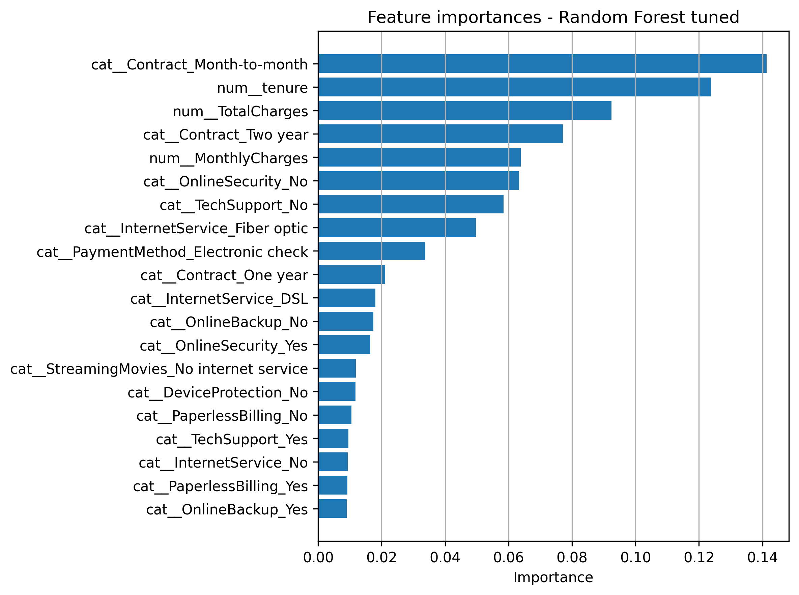
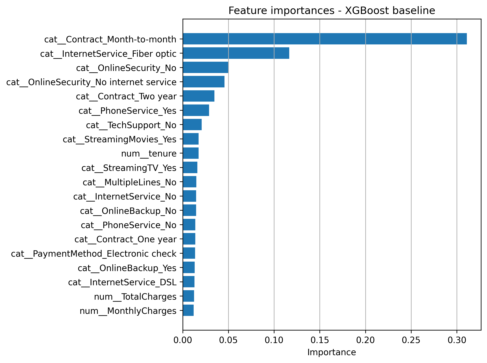

# Churn Prediction Platform

End-to-end machine learning project for **customer churn prediction**, combining data preprocessing, model comparison, business-oriented analysis and an interactive Streamlit dashboard.

The project uses the public **Telco Customer Churn** dataset and was structured as a small production-style ML workflow, from raw data to model evaluation and customer-level scoring.

## Key Results

- **Best ROC AUC:** ~0.84
- **Best churn recall:** ~0.78
- **Models compared:** Logistic Regression, Random Forest, XGBoost, PyTorch MLP
- **Final selected model:** Tuned Random Forest
- **Dataset size:** 7,043 customers
- **Interactive dashboard:** Streamlit
- **Business insight:** churn is highest among short-tenure and month-to-month customers

---

## Project Overview

The platform covers the full ML lifecycle:

- data cleaning and preprocessing,
- feature engineering,
- stratified train/validation/test splits,
- classical ML and deep learning models,
- hyperparameter tuning,
- ROC-based model comparison,
- feature-importance analysis,
- customer segmentation,
- interactive customer churn scoring.

The goal is not only to predict churn, but also to understand **which customer profiles are most at risk and why**.

---

## Dataset

The project uses the public **Telco Customer Churn** dataset.

Each row represents one customer and includes:

- demographics,
- contract information,
- billing and payment details,
- subscribed services,
- tenure,
- monthly and total charges,
- churn label.

The global churn rate is approximately **26.5%**.

---

## Machine Learning Pipeline

### 1. Data Preparation

The preprocessing pipeline:

- cleans column types,
- handles missing values,
- removes duplicates,
- converts `TotalCharges` to numeric,
- creates the binary `ChurnFlag` target,
- creates stratified train / validation / test splits.

Dataset split:

| Split | Samples |
|---|---:|
| Train | 4,225 |
| Validation | 1,409 |
| Test | 1,409 |

Numeric features are standardized with `StandardScaler`, while categorical features are encoded using `OneHotEncoder`.

---

### 2. Models

The following models were trained and compared:

#### Logistic Regression

A balanced linear baseline using:

```text
class_weight = balanced
max_iter = 1000
```

#### Random Forest

A baseline Random Forest followed by hyperparameter tuning with `RandomizedSearchCV`.

Parameters explored include:

- number of estimators,
- maximum tree depth,
- minimum samples per split,
- minimum samples per leaf,
- maximum number of features.

#### XGBoost

Gradient-boosted decision trees used as a strong non-linear baseline.

#### PyTorch MLP

A feed-forward neural network with:

- two hidden layers,
- ReLU activations,
- dropout,
- `BCEWithLogitsLoss`,
- class-imbalance weighting,
- Adam optimizer.

---

## Model Performance

Approximate test-set performance:

| Model | Accuracy | Precision | Recall | F1 | ROC AUC |
|---|---:|---:|---:|---:|---:|
| Logistic Regression | 0.7395 | 0.5060 | **0.7834** | 0.6149 | **0.8426** |
| Random Forest baseline | 0.7821 | 0.6143 | 0.4813 | 0.5397 | 0.8195 |
| Random Forest tuned | 0.7580 | 0.5311 | 0.7540 | **0.6232** | **0.8421** |
| XGBoost baseline | **0.7921** | **0.6302** | 0.5241 | 0.5723 | 0.8225 |

The tuned Random Forest was selected as the final model because it provides a strong balance between:

- ROC AUC,
- recall on churners,
- overall accuracy,
- interpretability.

---

## Business Insights

### Contract Type

| Contract | Churn rate |
|---|---:|
| Month-to-month | ~42.7% |
| One year | ~11.3% |
| Two year | ~2.8% |

Customers on month-to-month contracts churn much more frequently than customers with long-term contracts.

### Tenure

| Tenure | Churn rate |
|---|---:|
| 0–6 months | ~52.9% |
| 6–20 months | ~33.4% |
| 20–40 months | ~22.4% |
| 40–60 months | ~15.6% |
| 60–72 months | ~6.6% |

The first months of the customer lifecycle are the most critical for retention.

### Total Charges

Customers with lower total charges are significantly more likely to churn, which is strongly related to shorter tenure and weaker long-term engagement.

---

## Feature Importance

The most influential features for the tuned Random Forest include:

- `Contract_Month-to-month`
- `tenure`
- `TotalCharges`
- `Contract_Two year`
- `MonthlyCharges`
- `OnlineSecurity_No`
- `TechSupport_No`
- `InternetService_Fiber optic`
- `PaymentMethod_Electronic check`

These features are consistent with the churn-segmentation analysis and help explain which customer profiles are most at risk.

### Random Forest Feature Importance



### XGBoost Feature Importance



---

## Streamlit Dashboard

The project includes an interactive **Streamlit dashboard** for exploring both global churn patterns and individual customer predictions.

### Overview

- global churn KPI,
- customer count,
- churn by contract type,
- tenure distribution.

### Segments

Interactive churn analysis by:

- contract type,
- tenure group,
- total charges.

### Customer Scoring

The dashboard allows the user to:

- select a customer,
- inspect their profile,
- compute churn probability,
- adjust the decision threshold,
- compare the predicted label with the true label.

---

## Tech Stack

### Machine Learning

- Python
- Scikit-learn
- XGBoost
- PyTorch
- Pandas
- NumPy

### Data & Evaluation

- Stratified train / validation / test splitting
- Feature engineering
- Hyperparameter tuning
- ROC AUC
- Confusion matrices
- Feature importance analysis

### Application

- Streamlit
- Joblib

---

## Project Structure

```text
Churn/
├── data/
│   ├── raw/
│   ├── interim/
│   └── processed/
├── models/
├── reports/
│   ├── figures/
│   └── feature_importances/
├── dashboards/
│   └── streamlit_app/
├── src/
│   └── churn_platform/
│       ├── data/
│       ├── features/
│       ├── models/
│       ├── analysis/
│       ├── visualization/
│       └── cli/
├── requirements.txt
└── README.md
```

---

## Getting Started

### Prerequisites

- Python 3.9+
- pip

### Installation

```bash
git clone https://github.com/Alecbossard/Churn.git
cd Churn

python -m venv .venv
```

Activate the environment:

```bash
# Linux / macOS
source .venv/bin/activate

# Windows PowerShell
.venv\Scripts\Activate.ps1
```

Install dependencies:

```bash
pip install -r requirements.txt
```

---

## Running the Pipeline

Add `src/` to `PYTHONPATH`:

```bash
# Linux / macOS
export PYTHONPATH="$PWD/src"

# Windows PowerShell
$env:PYTHONPATH = "$PWD\src"
```

### Preprocessing

```bash
python -m churn_platform.cli.run_preprocess
```

### Train Models

```bash
python -m churn_platform.cli.run_training
python -m churn_platform.cli.run_training_rf
python -m churn_platform.cli.run_training_xgb
python -m churn_platform.cli.run_training_dl
```

### Tune Random Forest

```bash
python -m churn_platform.cli.run_tuning_rf
```

### Run Analysis

```bash
python -m churn_platform.cli.run_analysis
```

### Evaluate Models

```bash
python -m churn_platform.cli.run_evaluation
```

---

## Running the Dashboard

```bash
streamlit run dashboards/streamlit_app/app.py
```

The dashboard will typically be available at:

```text
http://localhost:8501
```

---

## Possible Extensions

Potential improvements include:

- SHAP-based interpretability,
- calibrated churn probabilities,
- segment-specific decision thresholds,
- model experiment tracking,
- automated tests,
- deployment of the scoring pipeline as an API.

---

## Author

**Alec Bossard**  
Engineering student in Robotics and Interactive Systems at UPSSITECH – University of Toulouse.

[LinkedIn](https://www.linkedin.com/in/alec-bossard/)
